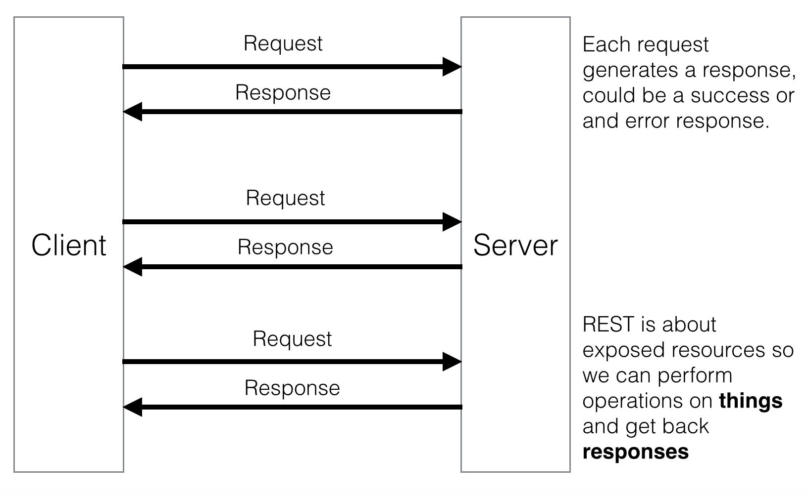
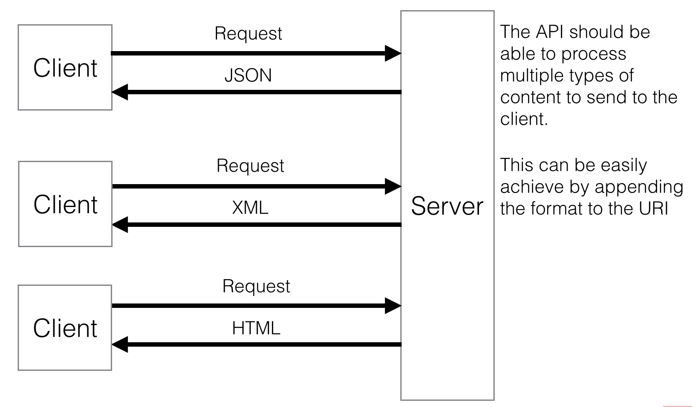

#APIs 101

Because we all want to talk to each other, no matter what.

###Topics
* Introduction to APIs
	* [Why should I care?](#why-should-i-care)
	* [Webservice structure](#webservice-structure)
	* [Resources & relationships structure](#resources--relationships-structure)
	* [Content-Negotiation](#content-negotiation)
	* [Actually using the API](#actually-using-the-api)
* [Versioning](#versioning)
	* Parameter
	* URL parameters
	* Headers
* [ActiveModelSerializers](#activemodelserializers)
* [Exploring API](#exploring-api)
	* Sabisu
* [Resources](#resources)

--

###Introduction to APIs

####Why should I care?

- It is scalable
- It is trendy
- The need to communicate multiple devices between each other
- Keep sync easily
- Performance
- Interoperability
- Mobile devices, watches, drones, arduino

####Webservice structure



####Resources & relationships structure

* Individual representation
	* Keep in mind that the root key of the resource should be the name of the resource, but just as a guide not actually a rule.

	**An individual resource should be represented as a simple JSON object**

```json
{
    "user": {
        "id": 1,
        "email": "kurenn@icalialabs.com",
        "name": "Abraham Kuri"      
    }
}
```

* Multiple resource representation

**A collection of resources should be represented as an
array of JSON objects**

```json
{
    "users": [{
            "id": 1,
            "email": "kurenn@icalialabs.com",
            "name": "Abraham Kuri"  
    }, {
            "id": 2,
            "email": "hola@hackerschool.mx",
            "name": "Da hacker school" 
        }]
}
```

* To-One Relationship Resource Representation

**An object embedded into another one**

```json
{
    "post": {
        "id": 1,
        "content": "This is me teaching you about APIs",
        "created_at": "2014-10-12T19:34:23Z",
        "author": {
            "id": 1,
            "name": "Abraham Kuri"
        }
    }
}
```

* To-Many Relationship Resource Representation

**An object embedded with a collection 
of other related objects**

```json
{
    "book": {
        "id": 1,
        "title": "API's on Rails",
        "authors": [{
            "id": 1,
            "name": "Abraham Kuri"
        }, {
            "id": 2,
            "name": "Osvaldo Ayala"
        }]
    }
}
```

*Be aware that this may be inefficient, due to the number of authors. In this case creating another endpoint for authors, would be a good solution.*

####Content-Negotiation

> Content negotiation is a mechanism defined in the HTTP specification that makes it possible to serve different versions of a document (or more generally, a resource representation) at the same URI
> 
> https://en.wikipedia.org/wiki/Content_negotiation

There are two ways in which you can specify the content you are requesting:

1. From the URI format(http://api.hackerschool.mx/members.json)
2. From an Accept Header (application/json)




####Actually using the API

We have put together a super simple API to play around a little bit:

[https://still-earth-6525.herokuapp.com/api/](https://still-earth-6525.herokuapp.com/api/)

It only contains a basic CRUD for users, the endpoints are as follow:

<table>
	<thead>
		<tr>
			<th>Request verb</th>
			<th>EndPoint</th>
			<th>Params</th>
			<th>Response Code</th>
		</tr>
	</thead>
	<tbody>
		<tr>
			<td>GET</td>
			<td>/users</td>
			<td> - </td>
			<td>200 - Success</td>
		</tr>
		<tr>
			<td>GET</td>
			<td>/users/:id</td>
			<td>:id</td>
			<td>200 - Success</td>
		</tr>
		<tr>
			<td>POST</td>
			<td>/users</td>
			<td>user[email], user[name]</td>
			<td>201 - Created</td>
		</tr>
		<tr>
			<td>PUT/PATCH</td>
			<td>/users/:id</td>
			<td>:id, user[email], user[name]</td>
			<td>200 - Success</td>
		</tr>
		<tr>
			<td>DELETE</td>
			<td>/users/:id</td>
			<td>:id</td>
			<td>204 - No content</td>
		</tr>
	</tbody>
</table>

We will need a client to test this, let's do it with [Postman](https://chrome.google.com/webstore/detail/postman-rest-client/fdmmgilgnpjigdojojpjoooidkmcomcm)

###Versioning

Versioning helps prevent major changes from breaking existing clients.

We can version the API and allow the access through different strategies:

**URI param**

With this approach you will expect a URI like:

`http://hackerschool.com/api/:version`

Here the `:version` could be:

* v1
* 1
* 1.023243
* v2.1.3

It really depends on your versioning structure.

**URL param**

With this approach you will expect a URI like:

`http://hackerschool.com/api?version=:version`

Here the `:version` could be:

* v1
* 1
* 1.023243
* v2.1.3

It really depends on your versioning structure.

**Request header**

With this approach you will expect a URI like:

`http://hackerschool.com/api/`

But on the request headers, you have to include something like:

`Accept: application/vnd.hackerschool.mx+json; version=1`

Here the `:version` could be:

* v1
* 1
* 1.023243
* v2.1.3

It really depends on your versioning structure.

--

*It is highly recommended that you keep your api behind a subdomain, this way you can scalate via DNS, in case your API is being under a heavy demand*

### ActiveModelSerializers

> ActiveModel::Serializers brings convention over configuration to your JSON generation.
> 
> https://github.com/rails-api/active_model_serializers

**Code Time**

###Exploring API

Sabisu is a powerful postman-like engine client to explore your Rails application api. It's still under heavy development, but it is quite impressive and beautiful

[https://github.com/IcaliaLabs/sabisu-rails](https://github.com/IcaliaLabs/sabisu-rails)

**Sabisu on the wild**

[http://sabisu.herokuapp.com/sabisu_rails/explorer](http://sabisu.herokuapp.com/sabisu_rails/explorer)

###Resources

* [http://jsonapi.org/](http://jsonapi.org/)
* [https://github.com/rails-api/active_model_serializers](https://github.com/rails-api/active_model_serializers)
* [http://apionrails.icalialabs.com/book/](http://apionrails.icalialabs.com/book/)
* [https://www.youtube.com/watch?v=HKksu4aq7Go](https://www.youtube.com/watch?v=HKksu4aq7Go)


